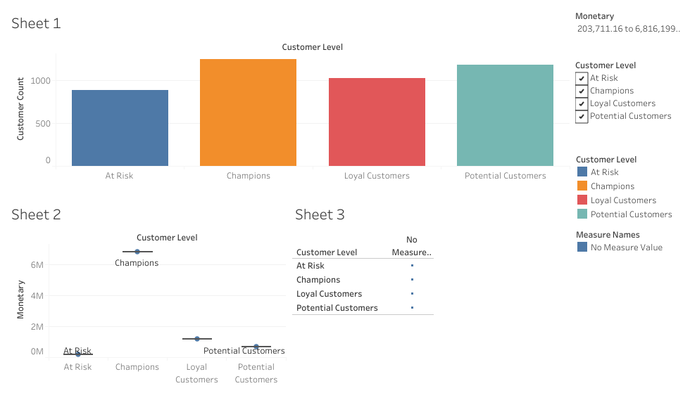

# 🧠 RFM Customer Segmentation Dashboard

This project analyzes customer behavior using Recency, Frequency, and Monetary (RFM) metrics and visualizes insights using Tableau.

## 📊 Features

- RFM metric calculation in Python
- Customer segments like Champions, Loyal, At Risk
- Interactive dashboard in Tableau with filters
- Business-friendly visuals (bar charts, heatmaps, boxplots)

## 🖼️ Dashboard Preview

## 🔗 Tableau Public Link
[View Full Dashboard]([https://public.tableau.com/views/your-dashboard-link-here](https://public.tableau.com/app/profile/jyotirmay.das/viz/RFMCustomerSegmentationDashboard_17534348218150/RFMCustomerSegmentationDashboardUnderstandingCustomerValueThroughBehavior))

## 📁 Dataset
- `RFM_Final.csv`

## 🤖 Built With
- Python (Pandas, Seaborn)
- Tableau Public
